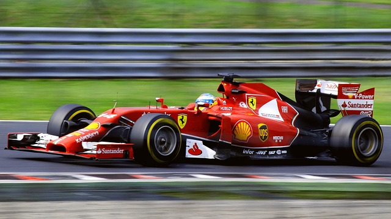

# F1 Pace Prediction



## Introduction
This project utilised data analysis and machine learning to predict team pace in Formula 1 race and qualifying sessions.

## Prerequisites
- Jupyter Notebook
- Matplotlib
- Numpy
- Pandas
- Scikit-learn
- Python 3.10+ (for newer type-hinting features)

## Installation
1. Clone the repository
2. Install the required packages: ```pip install -r requirements.txt```
3. Open the Jupyter Notebook in your preferred viewer and run.

## Details
### Author
This project (libraries excluded) belongs to https://github.com/edf1101
### License
This project is licensed under the MIT License - see the [LICENSE.md](LICENSE) file for details
### Acknowledgements
Data is provided by ...